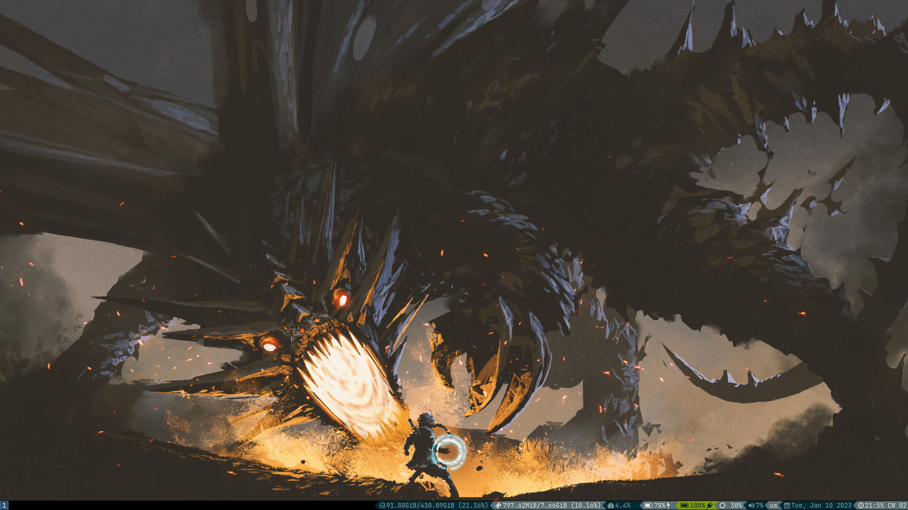
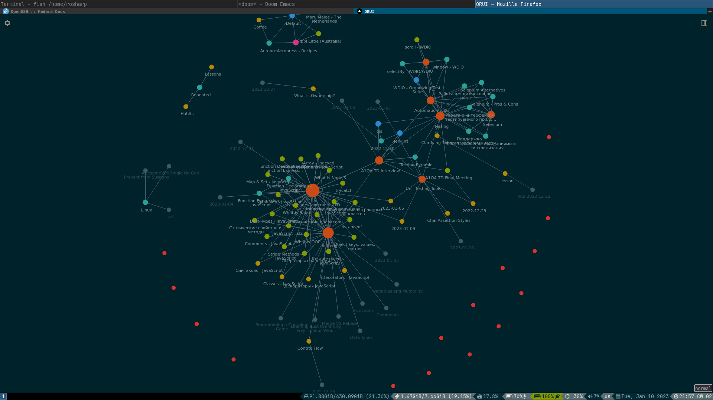
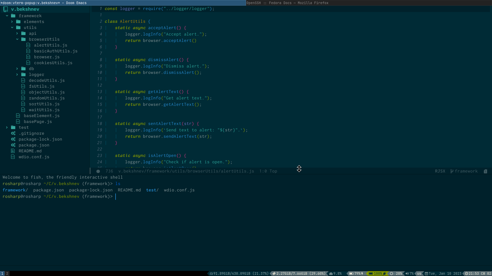
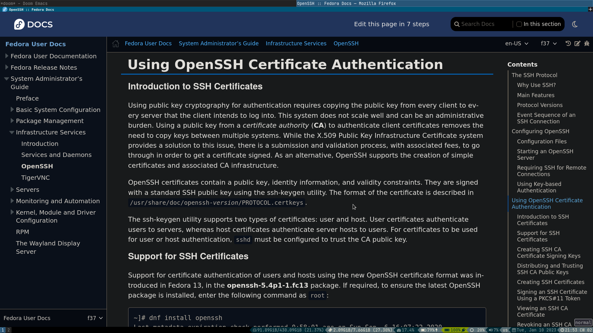

# Ro Sharp's Dotfiles

## Software

The programs I curently use:

- [i3](https://github.com/Airblader/i3) (it's more like i3-gaps, but those are merged now)
- [Doom Emacs](https://github.com/doomemacs/doomemacs) + [org-roam](https://github.com/org-roam/org-roam)
- Browser: Firefox/Tor

### Emacs Plugins

My essentials are (aside from default Doom plugins):

1. [org-roam](https://github.com/org-roam/org-roam) for managing notes and journaling
2. [org-bullets](https://melpa.org/#/org-bullets) for nice org headers
3. [org-pomodoro](https://melpa.org/#/org-pomodoro) for using pomodoro technique
4. [forge](https://melpa.org/#/forge) + [github-review](https://melpa.org/#/github-review) for Git
5. [elfeed](https://melpa.org/#/elfeed) as an RSS-feeds reader
6. [calibredb](https://melpa.org/#/calibredb) for keeping books and articles

## OS 

[Debian Stable](https://www.debian.org/releases/stable/) is indeed stable. It may lack some newest features (e.g. [PipeWire + Wireplumber](https://rosharp.github.io/posts/pipewire-with-wireplumber-on-debian/)), but most things are easy to set up since we have `apt`. 

